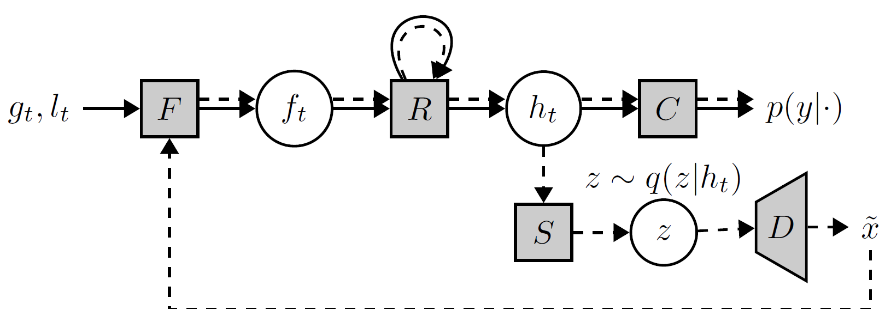
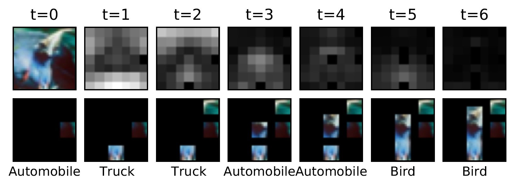

# "A Probabilistic Hard Attention Model For Sequentially Observed Scenes"
**Authors**: Samrudhdhi Rangrej, James Clark
**Accepted to**: BMVC'21

A recurrent attention model sequentially observes glimpses from an image and predicts a class label. At time *t*, the model actively observes a glimpse *g<sub>t</sub>* and its coordinates *l<sub>t</sub>*. Given *g<sub>t</sub>* and *l<sub>t</sub>*, the feed-forward module *F* extracts features *f<sub>t</sub>*, and the recurrent module *R* updates a hidden state to *h<sub>t</sub>*. Using an updated hidden state *h<sub>t</sub>*, the linear classifier *C* predicts the class distribution *p(y|h<sub>t</sub>)*. At time *t+1*, the model assesses various candidate locations *l* before attending an optimal one. It predicts *p(y|g,l,h<sub>t</sub>)* ahead of time and selects the candidate *l* that maximizes *KL[p(y|g,l,h<sub>t</sub>)||p(y|h<sub>t</sub>)]*. The model synthesizes the features of *g* using a Partial VAE to approximate *p(y|g,l,h<sub>t</sub>)* without attending to the glimpse *g*. The normalizing flow-based encoder *S* predicts the approximate posterior *q(z|h<sub>t</sub>)*. The decoder *D* uses a sample *z~q(z|h<sub>t</sub>)* to synthesize a feature map *f<sup>~</sup>* containing features of all glimpses. The model uses *f<sup>~</sup>(l)* as features of a glimpse at location *l* and evaluates *p(y|g,l,h<sub>t</sub>)=p(y|f<sup>~</sup>(l),h<sub>t</sub>)*. Dashed arrows show a path to compute the lookahead class distribution *p(y|f<sup>~</sup>(l),h<sub>t</sub>)*.

## Requirements:
torch==1.8.1,
torchvision==0.9.1,
tensorboard==2.5.0,
fire==0.4.0

## Datasets:
* SVHN (Let PyTorch download this dataset)
* CIFAR-10 (Let PyTorch download this dataset)
* CIFAR-100 (Let PyTorch download this dataset)
* CINIC-10 (download from: https://datashare.is.ed.ac.uk/bitstream/handle/10283/3192/CINIC-10.tar.gz, visit https://github.com/BayesWatch/cinic-10)
* TinyImageNet (download from: http://cs231n.stanford.edu/tiny-imagenet-200.zip)

## Training a model
Use `main.py` to train and evaluate the model.

**Arguments**
- `dataset`: one of `'svhn'`, `'cifar10'`, `'cifar100'`, `'cinic10'`, `'tinyimagenet'`
- `datapath`: path to the downloaded datasets
- `lr`: learning rate
- `training_phase`: one of `'first'`, `'second'`, `'third'`
- `ccebal`: coefficient for cross entropy loss
- `batch`: batch-size for training
- `batchv`: batch-size for evaluation
- `T`: maximum time-step
- `logfolder`: path to log directory
- `epochs`: number of training epochs
- `pretrain_checkpoint`: checkpoint for pretrained model from previous training phase

Example commands to train the model for SVHN dataset are as follows.
**Training Stage one**
```shell
python3 main.py \
    --dataset='svhn' \
    --datapath='./data/' \
    --lr=0.001 \
    --training_phase='first' \
    --ccebal=1 \
    --batch=64 \
    --batchv=64 \
    --T=7 \
    --logfolder='./svhn_log_first' \
    --epochs=1000 \
    --pretrain_checkpoint=None
```
**Training Stage two**
```shell
python3 main.py \
    --dataset='svhn' \
    --datapath='./data/' \
    --lr=0.001 \
    --training_phase='second' \
    --ccebal=0 \
    --batch=64 \
    --batchv=64 \
    --T=7 \
    --logfolder='./svhn_log_second' \
    --epochs=100 \
    --pretrain_checkpoint='./svhn_log_first/weights_f_1000.pth'
```
**Training Stage three**
```shell
python3 main.py \
    --dataset='svhn' \
    --datapath='./data/' \
    --lr=0.001 \
    --training_phase='third' \
    --ccebal=16 \
    --batch=64 \
    --batchv=64 \
    --T=7 \
    --logfolder='./svhn_log_third' \
    --epochs=100 \
    --pretrain_checkpoint='./svhn_log_second/weights_f_100.pth'
```

## Visualization of attention policy for a CIFAR-10 image

The top row shows the entire image and the *EIG* maps for *t=1* to *6*. The bottom row shows glimpses attended by our model. The model observes the first glimpse at a random location. Our model observes a glimpse of size *8x8*. The glimpses overlap with the stride of 4, resulting in a *7x7* grid of glimpses. The EIG maps are of size *7x7* and are upsampled for the display. We display the entire image for reference; our model never observes the whole image.

## Acknowledgement
Major parts of neural spline flows implementation are borrowed Karpathy's [pytorch-normalizing-flows](https://github.com/karpathy/pytorch-normalizing-flows).

